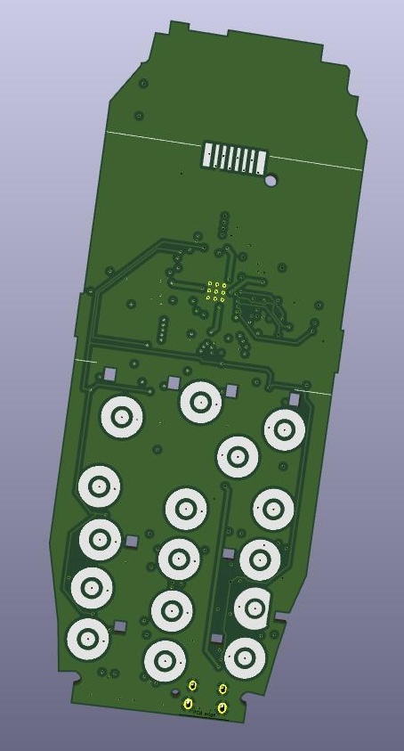
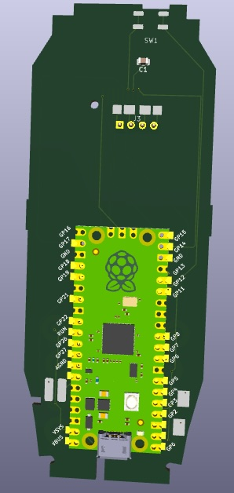

# Brique: RP235x Nokia 3310 Adapter Board

This started as a cute "what if?":

> What if I could type out messages on my smart phone by using tactile buttons like I used to have on my phone back in high school?

Because the board would need to fit into the chassis of a Nokia 3310 and because there are existing doodads that would be sitting alongside the board anyways, scope has crept to include connecting to these other thingamajigs.

## [Simulation](https://tommy-gilligan.github.io/brique/simulation)
## [API](https://tommy-gilligan.github.io/brique/doc/shared)

## Setting up web environment

## Setting up rp environment

## Setting up board
### Ordering Board
### Disassemble 3310
### Install Hardware Test Program
### Reassemble 3310
### Manual Test
### Install Custom Software

### TODO
#### v0.3
- create example that plays RTTTL (and writes it to screen)
- Snake
- USB text entry (can't really test properly until new board arrives but most of the right parts are there)
	- make textbox component
	- char to hid report
	- multitap
- give more control over display flushing, keep track of what needs updating, what needs flushing
	- display has command for clearing (don't need to send a whole buffer of blank, just to blank)
	- display can do 90deg rotated addressing

- pass more KiCAD checks in CI
- add back supercap rtc: just leave spot for it?  finding it hard to source
- power button (digital latch)
	- RTC alarm (INT) pin on RTC should connect to latch and GPIO
	- latch needs to be reseettable by GPIO
	- should probably have a bypass jumper
- motor contacts got messed up at seom stage, need to fix
- D12 clearance
- U2 clearance
- messed up power button footprint
- pin assignment for U6, U7, U8

- terse, unfriendly instructions (ie. README)
- document app API

#### Later
- charging IC should communicate state with rp2350 (charging, full, should be able to just sense 'LED' outputs)
- switch off after 5 minutes idle (switching on takes no time)
- rp2350 very low power state
- UI component model?
- power button: can this be triggered by 'any key'?  ie. any keypad press turns the device on.  there's enough GPIO to spare that we should have a dedicated GPIO for any key too)
- make all system work live on primary core.  give apps dedicated secondary core.
- optional pico-w for wifi/bluetooth (using a module avoids need for recertification?)
    - looks like RP will release such a module (RM2) so go ahead with designing with that in mind
- detect battery type to refuse NiMH
- battery gauge
- mic connection
- use text_input for inputing secret for TOTP (drives the need for inputting numeric digits easily and RTC)
- power button used for BOOT/RUN?
- how should software versions synchronize with hardware versions. what level of compatibility should be supported.
- institute changelog
- use 'Issues' instead of README for tracking
- USB on simulated device
- optimise GPIO pin mapping.  shorten traces etc.
- connection plate for 3d printing
- increase flash capacity? i'd prefer to remove this part altogether by using rp2354 due for release later in the year
- bring more rigour to 'scheduler'

#### Much Later
- flex pcb for keypad?
- LTE modem?
- e-ink display?

https://serdisplib.sourceforge.net/ser/pcd8544.html

84x48
